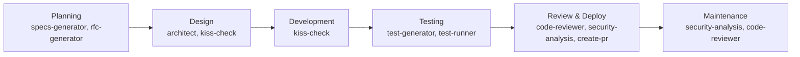

# my-claude-skills

> A collection of useful Claude Code skills and agents I use for work.

## 🧩 Skills Overview

| Skill | Description | Use Cases |
|-------|-------------|-----------|
| [**🏗️ architect**](skills/architect/SKILL.md) | Generates Mermaid.js architecture diagrams for modules and refactors. Keeps visual docs in sync. | New modules, API design, refactoring, data flows |
| [**🔍 code-reviewer**](skills/code-reviewer/SKILL.md) | Comprehensive code review covering quality, security, and maintainability. | PR reviews, feature completion, refactoring, bug fixes |
| [**📝 create-pr**](skills/create-pr/SKILL.md) | Creates pull requests with auto-generated title and description. | Ready to merge, finishing work, PR automation |
| [**✨ kiss-check**](skills/kiss-check/SKILL.md) | Forces justification for complex solutions. Must explain why simpler won't work. | Preventing overengineering, design reviews, architecture decisions |
| [**📋 rfc-generator**](skills/rfc-generator/SKILL.md) | Creates RFC documents for new features through interactive questioning. | Major features, architecture changes, team proposals |
| [**🔒 security-analysis**](skills/security-analysis/SKILL.md) | Identifies security vulnerabilities and analyzes security reports. | Security audits, PR checks, bug bounty triage |
| [**📐 specs-generator**](skills/specs-generator/SKILL.md) | Creates comprehensive SPECS.md files for new features and design docs. | Feature specs, implementation docs, design documentation |
| [**🧪 test-generator**](skills/test-generator/SKILL.md) | Generates unit and integration tests following existing patterns. | New features, bug fixes, improving test coverage |

## 🤖 Agents Overview

| Agent | Description | Use Cases |
|-------|-------------|-----------|
| [**🧪 test-runner**](agents/test-runner.md) | Runs tests and provides failure analysis without attempting fixes. | Running tests, analyzing test failures, debugging test suites |
| [**📊 kiss-enforcer**](agents/kiss-enforcer.md) | Enforces simplicity using the kiss-check skill. Identifies overengineering and ensures complexity is only necessary. | Code reviews, architecture decisions, preventing overengineering |

## 🚀 Skills & Agents in the SDLC

Skills and agents seamlessly integrate into your software development lifecycle, automating routine tasks and ensuring quality at every stage. Here's how they collaborate to supercharge your workflow:

- **Planning**: Use `specs-generator` for new features to avoid scope creep.
- **Design**: Run `architect` early to visualize your system before coding.
- **Building**: Let `kiss-check` challenge your complex ideas—simpler is often better.
- **Testing**: Pair `test-generator` with `test-runner` for automated testing workflows.
- **Shipping**: Deploy with `code-reviewer` and `security-analysis` to catch issues before production.
- **Maintaining**: Schedule regular `security-analysis` runs to stay ahead of threats.
