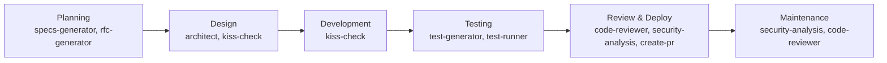

# my-claude-skills

> A collection of useful Claude Code skills and agents I use for work.

## 🧩 Skills Overview

| Skill | Description | Use Cases |
|-------|-------------|-----------|
| [**🏗️ architect**](skills/architect/SKILL.md) | Generates Mermaid.js architecture diagrams when creating or refactoring modules. Keeps visual documentation in sync with code changes. | New modules, API design, system refactoring, documenting data flows |
| [**🔍 code-reviewer**](skills/code-reviewer/SKILL.md) | Comprehensive code review combining quality, security, and maintainability checks. | PR reviews, feature completion, refactoring, bug fixes |
| [**📝 create-pr**](skills/create-pr/SKILL.md) | Creates a pull request for the current branch with auto-generated concise title and description. | Ready to merge, finishing work, PR creation automation |
| [**✨ kiss-check**](skills/kiss-check/SKILL.md) | Complexity check that forces justification for complex solutions. Before proposing Design Patterns or abstractions, must explain why a simpler approach won't work. | Preventing overengineering, design reviews, architecture decisions |
| [**📋 rfc-generator**](skills/rfc-generator/SKILL.md) | Creates comprehensive RFC (Request for Comments) documents for new features. Guides the user create the document through interactive questioning. | Major features, architecture changes, team proposals |
| [**🔒 security-analysis**](skills/security-analysis/SKILL.md) | Identifies security vulnerabilities in backend code and analyzes security reports. Use for PR security reviews, vulnerability assessments, or analyzing external bug bounty reports against the codebase. | Security audits, PR security checks, bug bounty triage |
| [**📐 specs-generator**](skills/specs-generator/SKILL.md) | Creates comprehensive SPECS.md specification files for new features. Use when the user wants to create specs, specifications, feature documentation, or design documents. | Feature specs, implementation docs, design documentation |
| [**🧪 test-generator**](skills/test-generator/SKILL.md) | Generates unit and integration tests for modified/added code following existing project patterns. | New features, bug fixes, improving test coverage |

## 🤖 Agents Overview

| Agent | Description | Use Cases |
|-------|-------------|-----------|
| [**🧪 test-runner**](agents/test-runner.md) | Specialized test execution agent. Runs specified tests and provides concise failure analysis without attempting fixes. | Running tests, analyzing test failures, debugging test suites |
| [**📊 kiss-enforcer**](agents/kiss-enforcer.md) | Complexity analysis specialist who enforces simplicity. Identifies overengineering and ensures complexity is only introduced when genuinely necessary. | Code reviews, architecture decisions, preventing overengineering |

## 🚀 Skills & Agents in the SDLC

Skills and agents seamlessly integrate into your software development lifecycle, automating routine tasks and ensuring quality at every stage. Here's how they collaborate to supercharge your workflow:

- **Planning**: Use `specs-generator` for new features to avoid scope creep.
- **Design**: Run `architect` early to visualize your system before coding.
- **Building**: Let `kiss-check` challenge your complex ideas—simpler is often better.
- **Testing**: Pair `test-generator` with `test-runner` for automated testing workflows.
- **Shipping**: Deploy with `code-reviewer` and `security-analysis` to catch issues before production.
- **Maintaining**: Schedule regular `security-analysis` runs to stay ahead of threats.
