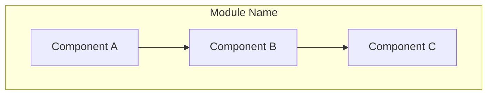
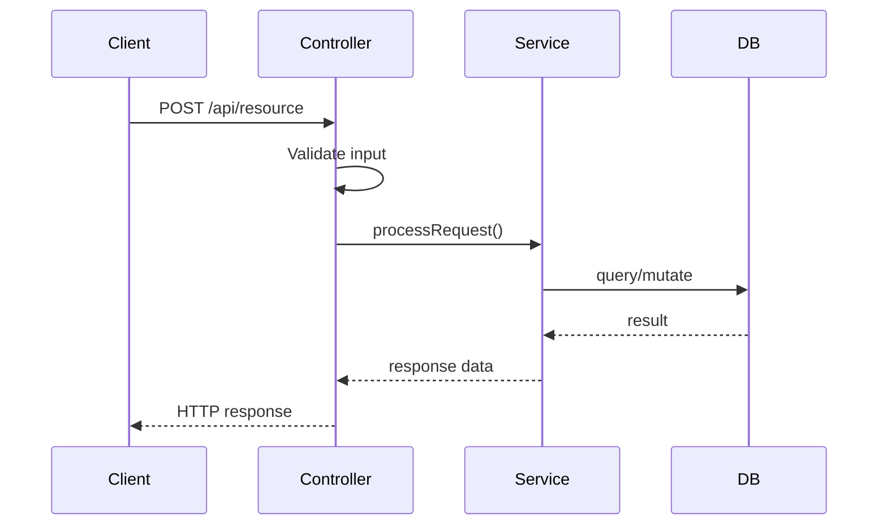

# The Architect

Bridge the gap between code and visual documentation by automatically generating Mermaid.js diagrams.

## When to Trigger

This skill should be invoked when:
- Creating a new module, service, or significant component
- Refactoring complex services or data flows
- Adding new integrations or external dependencies
- Modifying API endpoints or data models

## Instructions

### Step 1: Analyze the Code Changes

1. Identify the module/service being created or modified
2. Map out key components:
   - Classes and their relationships
   - Function call flows
   - External dependencies
   - Data flows (input → processing → output)
3. Identify integration points with other modules

### Step 2: Determine Diagram Type

Choose the appropriate Mermaid diagram type based on what you're documenting:

| Scenario | Diagram Type |
|----------|--------------|
| Module relationships | `flowchart` |
| API request flow | `sequenceDiagram` |
| State transitions | `stateDiagram-v2` |
| Data models | `classDiagram` |
| Process workflows | `flowchart` |
| System architecture | `flowchart` or `C4Context` |

### Step 3: Generate the Diagram

Create a Mermaid diagram following these conventions:



### Style Guidelines

- Use clear, descriptive node labels
- Group related components in subgraphs
- Use consistent arrow styles:
  - `-->` for data flow
  - `-.->` for optional/async flows
  - `==>` for critical paths
- Add comments to explain non-obvious connections
- Keep diagrams focused (max ~15 nodes per diagram)

### Step 4: Save the Diagram

1. Check if a `docs/` or `documentation/` directory exists in the project
2. If not, check for README files in the module directory
3. Save as one of:
   - `docs/architecture/[module-name].md` (preferred)
   - `[module-directory]/ARCHITECTURE.md`
   - Update existing README with diagram section

### Output Format

```markdown
# [Module Name] Architecture

## Overview
[Brief description of the module's purpose]

## Diagram
\`\`\`mermaid
[Generated Mermaid diagram]
\`\`\`

## Components

### [Component Name]
- **Purpose**: [What it does]
- **Inputs**: [What it receives]
- **Outputs**: [What it produces]

## Data Flow
[Brief explanation of how data moves through the system]
```

## Example: API Service



## Integration with Git

When generating diagrams after code changes:
1. Generate/update the diagram
2. Stage the diagram file
3. Include in the same commit as the code changes

## Notes

- Prefer updating existing diagrams over creating new ones
- If a diagram becomes too complex, split into multiple focused diagrams
- Always include a brief text description alongside the visual
